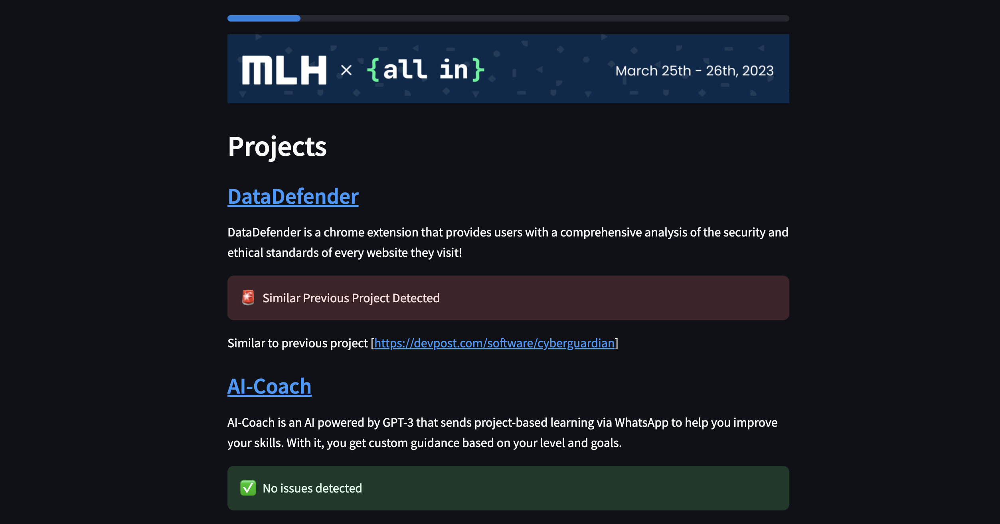
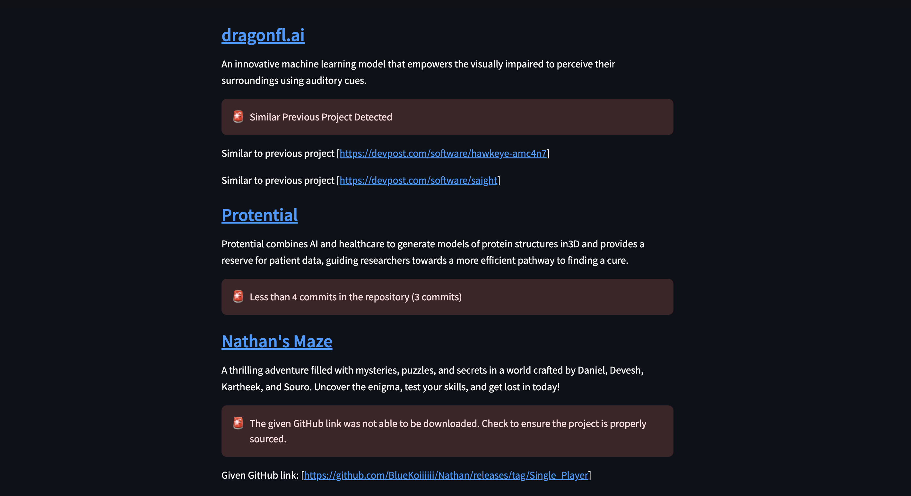

# Integrity

Integrity is a simple tool to scan a hackathon project gallery for misconduct. It is designed to be used by hackathon organizers to quickly identify projects that may be in violation of the hackathon rules.

## Screenshots

**Scanning in Progress**

**Flagged Projects**

### Features

- Similarity Scanning (e.g. scans related devpost projects for plagiarism)
- Suspicious Commit Detection (e.g. commits made outside the hackathon time frame)
- Contributor Count Verification (e.g. ensuring that the project was built by the accepted team size)

### Usage

1. Clone the repository
2. Install the dependencies using `pipenv install`
3. Setup up a `.env` file based on the `.env.example` file
4. Run the program using `streamlit run main.py`

### Contributors

Created @ HawkHacks 2024

